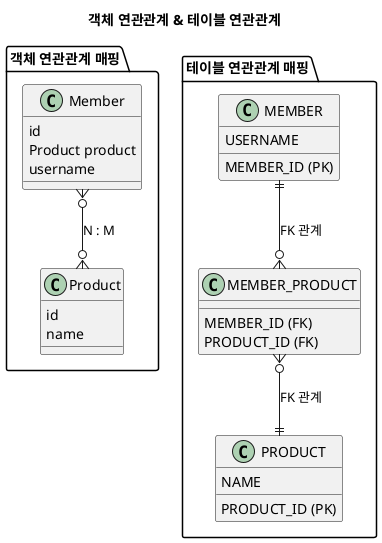
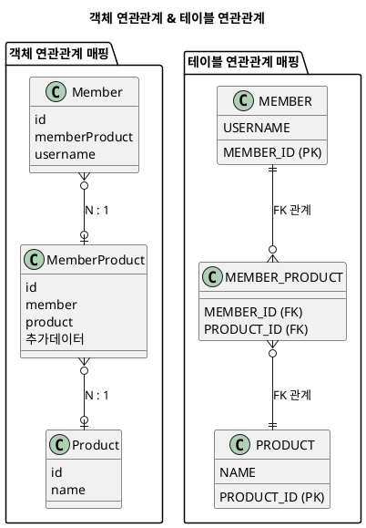

---
aliases:
  - "@ManyToMany"
  - 다대다(N:M)
tags:
  - Spring
  - Spring/JPA
  - Annotation
  - spring/Repository
특징: 
---
# @ManyToMany
- 사용해서는 안됨
- 관계형 DB 에서는 정규화된 테이블 2개로 다대다 관계를 표현할 수 없음
- 연결 테이블([[2.Ref(데이터 및 정보 저장)/Spring/Annotation/@JoinTable|@JoinTable]])을 사용해서 일대다 또는 다대다 관계로 풀어야함
- [[2.Ref(데이터 및 정보 저장)/Spring/Annotation/@ManyToMany|@ManyToMany]]  를 [[2.Ref(데이터 및 정보 저장)/Spring/Annotation/@OneToMany|@OneToMany]] 와 [[2.Ref(데이터 및 정보 저장)/Spring/Annotation/@ManyToOne|@ManyToOne]] 을 사용하여 소스를 작성하는 것을 추천
## 🚨 주의사항
## 🔍 속성 설명
```java
@Target({METHOD, FIELD}) 
@Retention(RUNTIME)
public @interface ManyToMany {
    Class targetEntity() default void.class;
    CascadeType[] cascade() default {};
    FetchType fetch() default FetchType.LAZY;
    String mappedBy() default "";
}
```
### 📌
## 🛠 사용 예제
### 추천하지 않는 방식


```java title:"ERD 참조한 소스"
@Entity
public class Member {
  @Id
  @GeneratedValue
  @Column(name = "MEMBER_ID")
  private Long id;
  private String name;
  @ManyToMany
  @JoinTable(name = "MEMBER_PRODUCT")
  private List<Product> products = new ArrayList<>();
}

@Entity
public class Product {
  @Id @GeneratedValue
  private Long id;
  private String name;
  @ManyToMany(mappedBy = "products")
  private List<Member> members = new ArrayList<>();
}

```

### 추천하지 않는 방식(다양한 방식이라 일단 작성)
```java
@Entity
public class Category {
  @Id @GeneratedValue
  @Column(name = "CATEGORY_ID")
  private Long id;

  private String name;
  @ManyToOne
  @JoinColumn(name = "PARENT_ID")
  private Category parent;

  @OneToMany(mappedBy = "parent")
  private List<Category> child = new ArrayList<>();

  @ManyToMany
  @JoinTable(name = "CATEGORY_ITEM",
    joinColumns = @JoinColumn(name = "CATEGORY_ID"),
    inverseJoinColumns = @JoinColumn(name = "ITEM_ID")
  )
  private List<Item> items = new ArrayList<>();
}

@Entity
public class Item {
  @Id
  @GeneratedValue
  @Column(name = "ITEM_ID")
  private Long id;
  private String name;
  private int price;
  private int stockQuantity;

  @ManyToMany(mappedBy = "items")
  private List<Category> categories = new ArrayList<>();
}

```
### 추천하는 방식


```java title:"ERD 를 통한 소스"
@Entity
public class Member {
  @Id
  @GeneratedValue
  @Column(name = "MEMBER_ID")
  private Long id;
  private String name;

//  @ManyToMany
//  @JoinTable(name = "MEMBER_PRODUCT")
//  private List<Product> products = new ArrayList<>();
  @OneToMany(mappedBy = "member")
  private List<MemberProduct> memberProducts = new ArrayList<>();
}

@Entity
public class MemberProduct {
  @Id @GeneratedValue
  private Long id;
  @ManyToOne
  @JoinColumn(name = "MEMBER_ID")
  private Member member;
  @ManyToOne
  @JoinColumn(name = "PRODUCT_ID")
  private Product product;
}

@Entity
public class Product {
  @Id @GeneratedValue
  @Column(name = "PRODUCT_ID")
  private Long id;
  private String name;
//  @ManyToMany(mappedBy = "products")
//  private List<Member> members = new ArrayList<>();
  @OneToMany(mappedBy = "product")
  private List<MemberProduct> memberProducts = new ArrayList<>();
}
```
