---
aliases:
  - "@ManyToOne"
  - 다대일(N:1)
tags:
  - Spring
  - Spring/JPA
  - Annotation
  - spring/Repository
특징: 내가 `Many` 일때 사용
---
# @ManyToOne
- 연관관계 매핑
- 내가 `Many` 일때 사용
- [[2.Ref(데이터 및 정보 저장)/Spring/Annotation/@JoinColumn|@JoinColumn]] 사용하여 외래 키 컬럼 지정 필요
- 외래키(FK)를 직접 관리하는 곳이기 때문에 [[2.Ref(데이터 및 정보 저장)/Spring/JPA/연관관계 주인|연관관계 주인]] 
## 🚨 주의사항
- 기본 fetch = FetchType.EAGER이므로, 성능 이슈가 발생할 수 있음
- **[[2.Ref(데이터 및 정보 저장)/Spring/JPA/FetchType|FetchType.LAZY]] 로 변경하는 것이 좋음**
- **[[2.Ref(데이터 및 정보 저장)/Spring/JPA/CascadeType|CascadeType]]  사용 주의 (연관된 엔티티가 삭제될 위험)**
## 🔍 속성 설명
```java
@Target({METHOD, FIELD}) 
@Retention(RUNTIME)

public @interface ManyToOne {
    Class targetEntity() default void.class;
    CascadeType[] cascade() default {};
    FetchType fetch() default FetchType.EAGER;
    boolean optional() default true;
}
```
> `targetEntity`: (선택 사항) 연관 대상 엔티티 클래스, 기본값은 필드나 속성의 타입
> `cascade`: (선택 사항) 연관 대상에 대해 수행할 연산을 지정, 기본값은 아무 연산도 수행하지 않음([[2.Ref(데이터 및 정보 저장)/Spring/JPA/CascadeType|CascadeType]])
> `fetch`: (선택 사항) 연관을 지연 로딩할지 즉시 로딩할지 지정, 기본값은 `FetchType.EAGER` ([[2.Ref(데이터 및 정보 저장)/Spring/JPA/FetchType|FetchType]])
> `optional`: (선택 사항) 연관이 선택적인지 여부를 지정, 연관된 [[2.Ref(데이터 및 정보 저장)/Spring/용어설명/Entity|Entity]] 가 존재해야하는지 설정, 기본값은 `true`

| 속성             | 설명                                 | 기본값       |
| -------------- | ---------------------------------- | --------- |
| `targetEntity` | 연관 대상 엔티티 클래스                      | 속성의 타입    |
| `cascade`      | 연관 대상에 대한 연산 수행                    | `{}` (없음) |
| `fetch`        | 즉시 로딩(`EAGER`) 또는 지연 로딩(`LAZY`) 여부 | `EAGER`   |
| `optional`     | 연관된 [[Entity]]가 존재해야 하는지 여부        | `true`    |
### 📌
## 🛠 사용 예제

```plantuml
title Member(1) 와 Order(N) 관계
@startuml
class Order {
  + Long id
  + OrderStatus status
  + LocalDateTime orderDate
}

class Member {
  + Long id
  + String name
}

Order }o--|| Member : "N:1"
@enduml
```

> Order(N) : Member(1) 관계의 표현
```java title:"@JoinColumn(name = "MEMBER_ID")을 통해 외래 키 지정"
@Entity
@Table(name = "ORDERS")
public class Order {
  @Id
  @GeneratedValue
  @Column(name = "ORDER_ID")
  private Long id;
//  @Column(name = "MEMBER_ID")
//  private Long memberId;
  @ManyToOne
  @JoinColumn(name = "MEMBER_ID")
  private Member member;
  @Enumerated(EnumType.STRING)
  private OrderStatus status;
  private LocalDateTime orderDate;
}
```