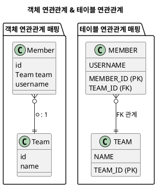

---
aliases:
  - "@OneToMany"
  - 일대다(1:N)
  - 양방향
tags:
  - Spring
  - Spring/JPA
  - Annotation
  - spring/Repository
특징: "내가 `\bOne` 일때 사용"
---
# @OneToMany
- 연관관계 매핑
- 내가 `One` 일때 사용
- 양방향일때 사용 가능
## 🚨 주의사항
- 단방향 [[2.Ref(데이터 및 정보 저장)/Spring/Annotation/@OneToMany]] 는 **외래 키를 관리할 수 없으므로** 성능상 비효율적
- [[2.Ref(데이터 및 정보 저장)/Spring/JPA/연관관계 주인|연관관계 주인]] 을 [[2.Ref(데이터 및 정보 저장)/Spring/Annotation/@ManyToOne|@ManyToOne]]  측으로 설정해야 함
- - **[[2.Ref(데이터 및 정보 저장)/Spring/JPA/FetchType|FetchType.LAZY]]로 변경하는 것이 좋음**
### [[2.Ref(데이터 및 정보 저장)/Spring/JPA/CascadeType|CascadeType.ALL]] 과 `orphanRemoval=true` 사용
- 부모 엔티티를 통해서 자식의 생명 주기를 관리
- [[2.Ref(데이터 및 정보 저장)/개발 이론/도메인 주도 설계(DDD)]] 의 [[2.Ref(데이터 및 정보 저장)/개발 이론/도메인 주도 설계(DDD)|Aggregate Root]]  개념을 구현할 때 유용
### 📌 무한루프 주의
- `toString()`, [[2.Ref(데이터 및 정보 저장)/Intellij/Lombok|Lombok]] , JSON 생성 라이브러리 등을 통한 자동 생성으로 무한루프 주의
## 🔍 속성 설명
```java
@Target({METHOD, FIELD}) 
@Retention(RUNTIME)

public @interface OneToMany {
    Class targetEntity() default void.class;
    CascadeType[] cascade() default {};
    FetchType fetch() default FetchType.LAZY;
    String mappedBy() default "";
    boolean orphanRemoval() default false;
}
```
> `targetEntity`: 연관된 엔티티 클래스. 제네릭스를 사용하여 컬렉션을 정의한 경우 생략할 수 있음
> `cascade`: 연관된 엔티티에 대해 수행할 연산을 지정, 기본값은 아무 연산도 수행하지 않음([[2.Ref(데이터 및 정보 저장)/Spring/JPA/CascadeType|CascadeType]])
> `fetch`: 연관된 엔티티를 지연 로딩(`LAZY`)할지 즉시 로딩(`EAGER`)할지 지정, 기본값은 FetchType.`LAZY`([[2.Ref(데이터 및 정보 저장)/Spring/JPA/FetchType|FetchType]])
> `mappedBy`: 양방향 관계에서 관계의 소유자 필드를 지정, 단방향 관계에서는 필요하지 않음
> `orphanRemoval`: 관계에서 제거된 엔티티를 삭제할지 여부를 지정, 기본값은 `false`
### 📌 `mappedBy`
- [[2.Ref(데이터 및 정보 저장)/Spring/Annotation/@OneToMany]] 사용하는 곳은 [[2.Ref(데이터 및 정보 저장)/Spring/JPA/연관관계 주인|연관관계 주인]]이 될 수 없음
### 📌`orphanRemoval` 
- 해당 객체에서 하위 객체를 삭제할 수 있게 할지 선택하는 기능
- 특정 엔티티가 개인 소유할 때 사용
- 참조하는 곳이 하나일 때 사용
## 🛠 사용 예제
### 양방향 작성 예제


```java title:"ERD 통하여 작성된 Entity"
@Entity
public class Team {
  @Id @GeneratedValue
  private Long id;
  private String name;
  @OneToMany(mappedBy = "team")
  private List<Member> members = new ArrayList<>();
}

@Entity
public class Member {
  @Id
  @GeneratedValue
  @Column(name = "MEMBER_ID")
  private Long id;
  private String name;
  @ManyToOne
  @JoinColumn(name = "TEAM_ID")
  private Team team;
}
```
### ⛔️ 양방향 작성 예제(공식적으로 지원하지 않는 양방향)
```java title:"단방향"
@Entity
public class Team {
  @Id @GeneratedValue
  private Long id;
  private String name;
  @OneToMany
  @JoinColumn(name = "TEAM_ID")
  private List<Member> members = new ArrayList<>();
}

@Entity
public class Member {
  @Id
  @GeneratedValue
  @Column(name = "MEMBER_ID")
  private Long id;
  private String name;
  @ManyToOne
  @JoinColumn(name = "TEAM_ID", insertable = false, updateable = false)
  private Team team;
}
```
> [[2.Ref(데이터 및 정보 저장)/Spring/JPA/연관관계 주인|연관관계 주인]] 을 `Team` 인것처럼 작성 후 `Member` 에서는 읽기 전용으로 만들어버리면 됨
> 해당 방법은 왠만해서 추천하지 않음
### 단방향 작성 예제(성능 비효율로 추천하지 않음)
```java title:"단방향"
@Entity
public class Team {
  @Id @GeneratedValue
  private Long id;
  private String name;
  @OneToMany
  @JoinColumn(name = "TEAM_ID")
  private List<Member> members = new ArrayList<>();
}

@Entity
public class Member {
  @Id
  @GeneratedValue
  @Column(name = "MEMBER_ID")
  private Long id;
  private String name;
}
```
> [[2.Ref(데이터 및 정보 저장)/Spring/JPA/연관관계 주인|연관관계 주인]] 설정 다른 테이블에 있음
> 쿼리가 3번(Team insert 1번, Member insert 1번, Team 에 Member 추가 update 1번) 동작해야하기 때문에 추천하지 않음
- [[2.Ref(데이터 및 정보 저장)/Spring/Annotation/@JoinColumn|@JoinColumn]] 을 작성하지 않으면 [[2.Ref(데이터 및 정보 저장)/Spring/Annotation/@JoinTable]] 이 추가됨