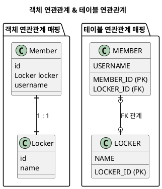

---
aliases:
  - "@OneToOne"
  - 일대일(1:1)
tags:
  - Spring
  - Spring/JPA
  - Annotation
  - spring/Repository
특징: 
---
# @OneToOne
- [[2.Ref(데이터 및 정보 저장)/Spring/JPA/연관관계 주인|연관관계 주인]] 설정을 둘 다 `One` 이기 때문에 어디든 가능
	- 보통 주 테이블에 외래 키
## 🚨 주의사항
- 외래 키에 데이터베이스 유니크 제약 조건 추가
- [[2.Ref(데이터 및 정보 저장)/Spring/JPA/FetchType|FetchType]] 의 지연 로딩(`LAZY`)을 설정해도 항상 즉시 로딩(`EAGER`)됨
## 🔍 속성 설명
### 📌
## 🛠 사용 예제


```java title:"ERD 에 대한 소스"
@Entity
public class Member {
  @Id
  @GeneratedValue
  @Column(name = "MEMBER_ID")
  private Long id;
  @OneToOne
  @JoinColumn(name = "LOCKER_ID")
  private Locker locker;
}

@Entity
public class Locker {
  @Id @GeneratedValue
  @Column(name = "LOCKER_ID")
  private Long id;
  private String name;
  @OneToOne(mappedBy = "locker")
  private Member member;
}
```