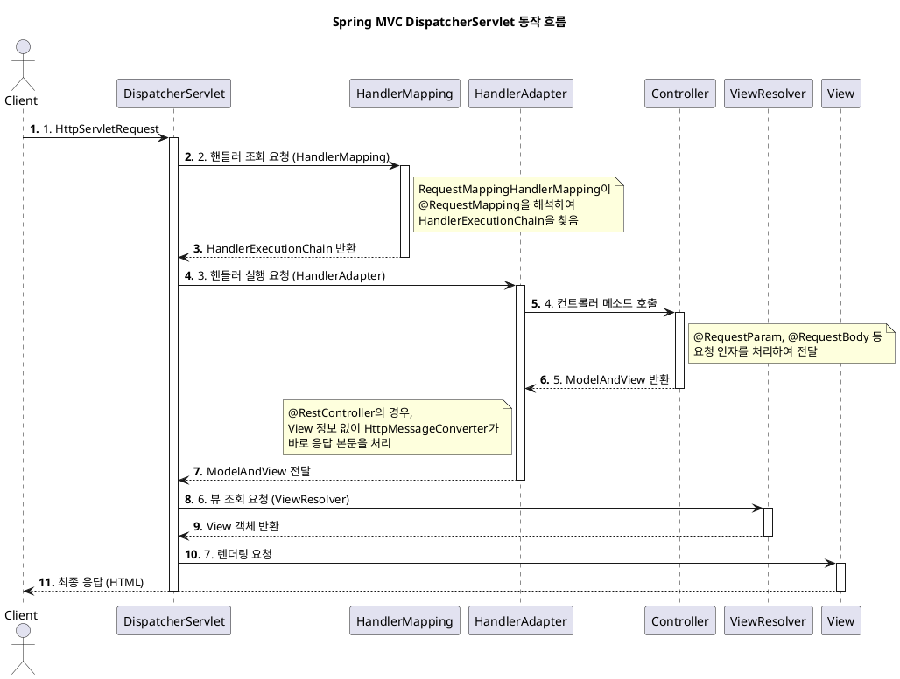

---
aliases:
  - FrontController
  - 프론트 컨트롤러
  - DispatcherServlet
tags:
  - Spring
특징: 한곳에서 모든 URI 관리하기 위해 사용
isPublic: true
createdAt: 2023-11-30 10:05
updatedAt: 2025-09-15 15:23
---
# DispatcherServlet
- 한곳에서 모든 [[URI]] 을 관리하기 위해 사용
- 가장 우선으로 모든 요청을 받는 컨트롤러
	- 스프링 MVC의 **핵심**이자 모든 웹 요청을 가장 먼저 받아 처리하는 **프론트 컨트롤러(Front Controller)**
  스프링 부트에서는 이 모든 과정이 자동 설정되어 있어 개발자가 직접 설정할 일은 거의 없음
- **과거 방식 (DispatcherServlet 없을 때)**
    - `/login`, `/articles` 등 각 요청마다 별도의 서블릿을 구현해야 했음
    - 공통 기능(인증, 로깅 등)을 모든 서블릿에 중복으로 작성해야 해서 비효율적
- **현재 방식 (DispatcherServlet 사용)**
    - 모든 요청을 `DispatcherServlet`이 일단 받음
    - 공통 기능을 처리한 후, 요청에 맞는 컨트롤러(핸들러)에게 작업을 위임
    - 개발자는 실제 비즈니스 로직을 담은 컨트롤러만 작성하면 됨
- `@WebServlet(name=??, urlPatterns = "*/*")` 형태로 되어 있을 컨트롤러
1. [[URI]]를 받아서 [[2.Ref(데이터 및 정보 저장)/Spring/HandlerMapping]]에 있는지 확인
	1. 없다면 정적 리소스에서 찾아봄
	2. 있다면 [[2.Ref(데이터 및 정보 저장)/Spring/HandlerAdapter]] 에게 전달

## 내부 동작 흐름
`{java}protected void doDispatch(HttpServletRequest request, HttpServletResponse response)` 함수의 동작 흐름

1.  **요청 접수**
    - 클라이언트로부터 모든 [[2.Ref(데이터 및 정보 저장)/Spring/HttpServletRequest|HttpServletRequest]]를 받음
2.  **핸들러 매핑 (Handler Mapping)**
    - 요청 `URI`에 맞는 컨트롤러(핸들러)를 찾아내도록 [[HandlerMapping]]에게 요청
    - 주로 [[2.Ref(데이터 및 정보 저장)/Spring/Annotation/@RequestMapping|@RequestMapping]]  어노테이션을 해석하는 [[2.Ref(데이터 및 정보 저장)/Spring/HandlerMapping|RequestMappingHandlerMapping]] 이 사용됨
    - [[HandlerMapping]]은 실행할 컨트롤러 메소드 정보가 담긴 [[HandlerExecutionChain]]을 반환
3.  **핸들러 어댑터 조회 (Handler Adapter)**
    - 찾아낸 핸들러를 실행할 수 있는 [[HandlerAdapter]]를 조회
    - [[2.Ref(데이터 및 정보 저장)/Spring/Annotation/@RequestMapping|@RequestMapping]] 컨트롤러는 [[2.Ref(데이터 및 정보 저장)/Spring/HandlerAdapter|RequestMappingHandlerAdapter]] 가 실행함
4.  **핸들러 어댑터 실행 → 컨트롤러 호출**
    - [[HandlerAdapter]]가 실제 컨트롤러의 메소드를 호출
    - 이때 요청 인자([[2.Ref(데이터 및 정보 저장)/Spring/Annotation/@RequestParam|@RequestParam]], [[2.Ref(데이터 및 정보 저장)/Spring/Annotation/@RequestBody|@RequestBody]] 등)를 처리하여 메소드에 전달
5.  **ModelAndView 반환**
    - 컨트롤러는 비즈니스 로직 실행 후, 뷰 이름과 모델 데이터를 담은 [[ModelAndView]] 객체를 반환
    - ([[2.Ref(데이터 및 정보 저장)/Spring/Annotation/@RestController|@RestController]]처럼 [[2.Ref(데이터 및 정보 저장)/Spring/Annotation/@ResponseBody|@ResponseBody]]가 사용된 경우, `View`는 생략되고 [[2.Ref(데이터 및 정보 저장)/Spring/변환기/HttpMessageConverter|HttpMessageConverter]]가 바로 응답 본문을 만듦)
6.  **뷰 리졸버 (View Resolver)**
    - [[ModelAndView]]의 논리적인 뷰 이름(예: `"articles/list"`)을 실제 물리적인 뷰 객체로 변환
    - (예: [[ThymeleafViewResolver]]는 해당 이름의 HTML 파일을 찾아 렌더링할 준비를 함)
7.  **뷰 렌더링 (View Rendering)**
    - `View` 객체가 모델 데이터를 바탕으로 최종 결과(HTML 등)를 렌더링하여 [[2.Ref(데이터 및 정보 저장)/Spring/HttpServletResponse|HttpServletResponse]]에 담아 클라이언트에게 응답

## 간략한 흐름도
실제 개발 시 `DispatcherServlet`을 직접 다루진 않지만, 우리가 작성하는 컨트롤러가 이 흐름 속에서 동작함
```java
@RestController
public class HelloController {

    @GetMapping("/hello")
    public String hello(@RequestParam("name") String name) {
        return "Hello, " + name;
    }
}
```
1. 요청: 클라이언트가 /hello?name=Spring 요청
2. [[2.Ref(데이터 및 정보 저장)/Spring/DispatcherServlet|DispatcherServlet]] : 요청을 받음
3. [[2.Ref(데이터 및 정보 저장)/Spring/HandlerMapping|HandlerMapping]] : /hello를 처리할 hello() 메소드를 찾아냄
4. [[2.Ref(데이터 및 정보 저장)/Spring/HandlerAdapter|HandlerAdapter]] : hello() 메소드를 호출하면서 @RequestParam을 해석하여 "Spring"이라는 값을 name 파라미터에 넣어줌
5. [[2.Ref(데이터 및 정보 저장)/Spring/용어설명/Controller|Controller]] : 메소드 실행 후 "Hello, Spring" 문자열 반환
6. [[2.Ref(데이터 및 정보 저장)/Spring/DispatcherServlet|DispatcherServlet]] : 반환된 문자열을 [[2.Ref(데이터 및 정보 저장)/Spring/변환기/HttpMessageConverter|HttpMessageConverter]]  통해 HTTP 응답 본문에 담아 클라이언트에게 전송
