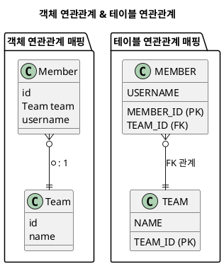

---
aliases:
  - 연관관계 주인
tags:
  - Spring
  - Spring/JPA
  - spring/Repository
특징: "@ManyToOne이 적용된 곳"
---
# 연관관계 주인
- `FK`누가 가지고 관리하고 있는지에 대한 것
- **외래 키(FK)를 관리하는 [[2.Ref(데이터 및 정보 저장)/Spring/용어설명/Entity|엔티티]] ** (즉, [[2.Ref(데이터 및 정보 저장)/Spring/Annotation/@ManyToOne|@ManyToOne]] 이 적용된 곳)
	- `FK`를 관리하는 곳은 [[2.Ref(데이터 및 정보 저장)/Spring/Annotation/@OneToMany|@OneToMany]] 를 사용하는 곳에서는 자기자신의 `PK`를 `FK`로 사용하지 않기 때문에 주인이 될 수 없음, [[2.Ref(데이터 및 정보 저장)/Spring/Annotation/@ManyToOne|@ManyToOne]] 사용하는 곳이 주인
	- 결론 : **외래키(`FK`)가 있는 곳이 주인**
- 양방향일때만 사용하는 개념
- 연관관계 주인은 등록, 수정 등의 기능 사용 가능
- 연관관계 주인이 아닌(`mappedBy`) 경우 읽기만 가능
## 📌 외래키(FK)가 있는 곳이 연관관계 주인인 이유

- 테이블 연관관계를 보면 `FK`를 통해 관계를 연결하는 것을 확인
```SQL title:"FK 이용하여 양방향으로 작성 가능 확인"
SELECT *
FROM MEMBER M
JOIN TEAM T ON M.TEAM_ID = T.TEAM_ID

SELECT *
FROM TEAM T
JOIN MEMBER M ON T.TEAM_ID = M.TEAM_ID
```
>`MEMBER` 테이블의 `TEAM_ID`가 `TEAM` 테이블의 `TEAM_ID`를 참조하기 때문에  두 테이블을 **JOIN**하여 데이터를 가져올 수 있음.
## 🚨 주의사항
- 주인은 `mappedBy` 속성을 사용해서는 안됨
- 주인이 아니면 `mappedBy`  속성으로 주인 지정
- 값을 세팅할땐 주인에 값만 세팅을 해도 되지만 [[2.Ref(데이터 및 정보 저장)/Spring/JPA/Persistence|영속성 컨텍스트]] 에 등록되지 않았을때를 대비하여 양측에 모두 값을 저장하는 것이 합리적
## 🛠 사용 예제
```java title:"ERD 통하여 작성된 Entity"
@Entity
public class Team {
  @Id @GeneratedValue
  private Long id;
  private String name;
  @OneToMany(mappedBy = "team")
  private List<Member> members = new ArrayList<>();
}

@Entity
public class Member {
  @Id
  @GeneratedValue
  @Column(name = "MEMBER_ID")
  private Long id;
  private String name;
  @ManyToOne
  @JoinColumn(name = "TEAM_ID")
  private Team team;
}
```