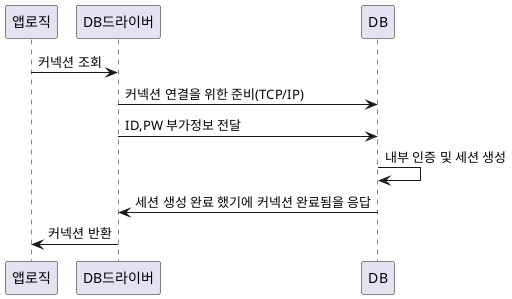

# 데이터 접근
보통 95% 는 [[2.Ref(데이터 및 정보 저장)/Spring/JPA/JPA|JPA]] 사용
일부 5% 정도는 복잡한 쿼리 수행을 위해 [[#JdbcTemplate]] 또는 [[#MyBatis]] 사용하여 처리
복잡한 쿼리가 많을 수록 사용 비중이 높아질 수 있음
트랜잭션 메니저는 `JpaTransactionManager` 그대로 사용하는 것을 추천


# JDBC(Java Database Connectivity)
![[config/AttachedFile/Pasted image 20240517151106.png|600]]
> 이전에는 모두 다 방법이 달랐기 때문에 그 방법을 공통으로 사용할 인터페이스를 만든 것이 JDBC

1997년 출시된 기술이기 때문에 사용 방법이 복잡하기에 편리하게 사용하기 위한 다양한 기술의 발전
## JDBC를 편하게 사용하기 위해 만들어진 기술
- SQL Mapper
- ORM

## SQL Mapper
SQL만 작성하면 SQL 결과를 객체로 편리하게 매핑
JDBC 직접 사용시 발생하는 여러 중복을 제거
개발자에게 여러가지 편리한 기능 제공
 - 장점
	 - JDBC 편리하게 사용하도록 도움
	 - JDBC 반복 코드 제거
 - 단점
	 - 개발자가 SQL 직접 작성
 - 대표 기술
	 - `JdbcTemplate`
	 - `Mybatis`
## ORM
관계형 데이터 베이스 테이블과 매핑해주는 기술
반복적인 SQL 직접 작성할 필요 없음
SQL 동적으로 사용
- 대표 기술
	- [[2.Ref(데이터 및 정보 저장)/Spring/JPA/JPA|JPA]] (인터페이스)
		- JPA 구현체
			-  JPA Hibernate(하이버네이트)[표준]
			- 이클립스링크
`Spring Data JPA`,[[2.Ref(데이터 및 정보 저장)/Spring/Repository/QueryDSL]] [[2.Ref(데이터 및 정보 저장)/Spring/JPA/JPA|JPA]]  더 편리하게 사용할 수 있게 도와주는 프로젝트
## JDBC 동작 구조
DriverManager(라이브러리에 등록된 모든 DB 드라이브) 를 통해서 getConnection 으로 URL 등을 가지고 등록된 Driver 모두 확인 해서 JdbcConnection 을 전달
SQL Injection 당하지 않기 위해 `{java}String sql = "insert into member(member_id, money) values(?, ?)";` 이런 형식으로 ? 형태를 취함. ? 말고 문자열을 넣으면 문자열에다가 insert 문을 넣을수도 있잖아?
# 커넥션 풀

해당 과정을 사용자마다 생성하기에는 번거롭고 시간이 많이 걸리기 때문에 한번에 만들어 놓는 방법을 커넥션 풀이라 함

```plantuml
autonumber
participant 앱로직 as 앱로직
participant DB드라이버 as DB드라이버 
participant 커넥션풀 as 커넥션풀
participant DB as DB

DB드라이버 -> DB : 커넥션 연결 요청 *N
DB -> DB드라이버 : 커넥션 *N
DB드라이버 -> 커넥션풀 : 커넥션 *N개 저장
앱로직 -> DB드라이버 : 커넥션 조회
DB드라이버 -> 커넥션풀 : 커넥션 요청
커넥션풀 -> DB드라이버 : 커넥션 반환
DB드라이버 -> 앱로직 : 커넥션 전달
앱로직 -> 앱로직 : 커넥션 사용
앱로직 -> DB드라이버 : 커넥션 반환
DB드라이버 -> 커넥션풀 : 커넥션 반환
```

정해진 개수의 커넥션만 연결하기 때문에 커넥션 제한 가능
미리 등록 하기 때문에 연결에 필요한 시간을 아낄 수 있음

## 대표적인 커넥션 풀 구현한 오픈소스
- commons-dbcp2
- tomcat-jdbc
- HikariCP

[[2.Ref(데이터 및 정보 저장)/Spring/Repository/DataSource|DataSource]]
[[2.Ref(데이터 및 정보 저장)/Spring/Exception/1.Exception|1.Exception]]
[[2.Ref(데이터 및 정보 저장)/Spring/Repository/JdbcTemplate|JdbcTemplate]]
[[2.Ref(데이터 및 정보 저장)/Spring/Repository/1.Transaction|Transaction]]
# 테스트
#TEST
## 트랜잭션을 이용한 롤백 방법
```java title:"트랜잭션을 이용한 롤백 방법" hl:7-9,11-14,16-23
@SpringBootTest
class ItemRepositoryTest {

    @Autowired
    ItemRepository itemRepository;

    @Autowired
    PlatformTransactionManager transactionManager;
    TransactionStatus transactionStatus;

    @BeforeEach
    void beforeEach() {
        transactionStatus = transactionManager.getTransaction(new DefaultTransactionDefinition());
    }

    @AfterEach
    void afterEach() {
        //MemoryItemRepository 의 경우 제한적으로 사용
        if (itemRepository instanceof MemoryItemRepository) {
            ((MemoryItemRepository) itemRepository).clearStore();
        }
        transactionManager.rollback(transactionStatus);
    }
}
```

## [[2.Ref(데이터 및 정보 저장)/Spring/Annotation/@Transactional|@Transactional]] 이용한 롤백 방법
```java title:"@Transactional 이용한 테스트 완료 후 rollback 방법 " hl:1
@Transactional
@SpringBootTest
class ItemRepositoryTest {

    @Autowired
    ItemRepository itemRepository;

//    @Autowired
//    PlatformTransactionManager transactionManager;
//    TransactionStatus transactionStatus;

    @BeforeEach
    void beforeEach() {
//        transactionStatus = transactionManager.getTransaction(new DefaultTransactionDefinition());
    }

    @AfterEach
    void afterEach() {
        //MemoryItemRepository 의 경우 제한적으로 사용
        if (itemRepository instanceof MemoryItemRepository) {
            ((MemoryItemRepository) itemRepository).clearStore();
        }
//        transactionManager.rollback(transactionStatus);
    }
```
### 강제 커밋하기
테스트에서는 강제로 `rollback` 동작하지만 이걸 막고 `commit` 을 하고 싶다면 하고 싶은 함수 위에 [[2.Ref(데이터 및 정보 저장)/Spring/Annotation/@Commit|@Commit]] 또는 [[2.Ref(데이터 및 정보 저장)/Spring/Annotation/@Rollback|@Rollback]] 값으로 `false` 전달

[[2.Ref(데이터 및 정보 저장)/Spring/Repository/H2]]
# DB 초기 DDL 설정
`resource/schema.sql` 넣으면 자동으로 설정
test 의 경우 `test/resource/schema.sql` 사용

[[2.Ref(데이터 및 정보 저장)/Spring/Repository/MyBatis|MyBatis]]
[[2.Ref(데이터 및 정보 저장)/Spring/JPA/JPA|JPA]]


