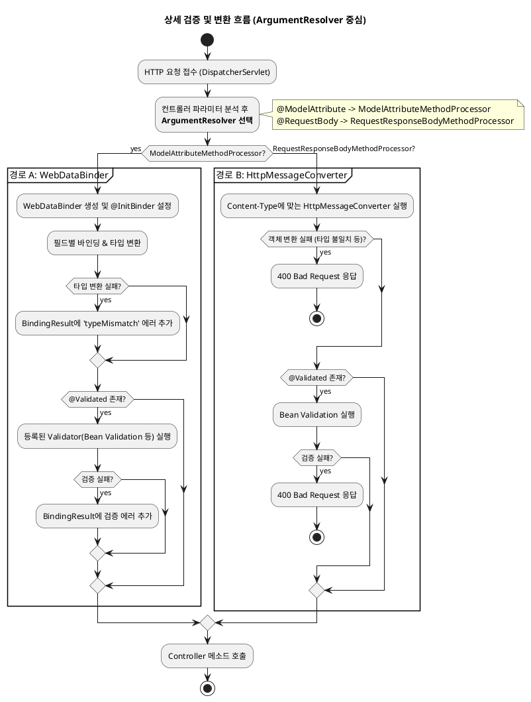

---
aliases:
  - 검증에 대해
tags:
  - Spring
  - Spring/Validation
  - index
특징: 검증 로직
isPublic: true
---
# 검증
- [[2.Ref(데이터 및 정보 저장)/Spring/Annotation/@Validated-@Valid|@Validated]] 통해서 사용
- 보통 [[2.Ref(데이터 및 정보 저장)/Spring/Validator/Bean Validation|Bean Validation]] 사용하는데 Java의 `Validator`로 만들어져있고 Spring 의 [[2.Ref(데이터 및 정보 저장)/Spring/Validator/Validator|Validator]]  와 다른 것이기 때문에 이걸 해결하기 위해
- [[0.New Note/LocalValidatorFactoryBean|LocalValidatorFactoryBean]] 사용하여 Spring 의 [[2.Ref(데이터 및 정보 저장)/Spring/Validator/Validator|Validator]] 인척하고 사용됨
- 검증된 결과는 [[2.Ref(데이터 및 정보 저장)/Spring/Validator/BindingResult|BindingResult]] 에서 확인 가능
	- 데이터 타입 문제가 발생할 경우 [[0.New Note/WebDataBinder|WebDataBinder]] 으로 분석되는지 [[2.Ref(데이터 및 정보 저장)/Spring/변환기/HttpMessageConverter|HttpMessageConverter]] 으로 분석되는지에 따라서 데이터 타입 분석이 될지 말지 분간됨
## 흐름도

- [[2.Ref(데이터 및 정보 저장)/Spring/변환기/HttpMessageConverter|HttpMessageConverter]] 쪽으로 가게 되면 [[2.Ref(데이터 및 정보 저장)/Spring/Validator/BindingResult|BindingResult]] 사용할 수 없음
	- [[2.Ref(데이터 및 정보 저장)/Spring/변환기/HttpMessageConverter|HttpMessageConverter]] 쪽은 [[2.Ref(데이터 및 정보 저장)/Spring/Annotation/@RequestBody|@RequestBody]] 등은 [[2.Ref(데이터 및 정보 저장)/Spring/Annotation/@RestControllerAdvice|@RestControllerAdvice]] 와 [[2.Ref(데이터 및 정보 저장)/Spring/Annotation/@ExceptionHandler|@ExceptionHandler]] 에서 처리 가능
```java title:"HttpMessageConverter 쪽으로 검증 처리 방법"
@RestControllerAdvice
public class GlobalExceptionHandler {

    // MethodArgumentNotValidException 예외가 발생하면 이 메소드가 실행됨
    @ExceptionHandler(MethodArgumentNotValidException.class)
    @ResponseStatus(HttpStatus.BAD_REQUEST) // HTTP 상태 코드를 400으로 응답
    public ErrorResponse handleValidationExceptions(MethodArgumentNotValidException ex) {
        
        // ex.getBindingResult()를 통해 BindingResult에 접근 가능
        // 여기서 에러 정보를 가공하여 클라이언트에게 보기 좋은 형태로 응답
        // ...

        return new ErrorResponse("VALIDATION_FAILED", "검증에 실패했습니다.");
    }
}
```
### 관련 내용 링크
- [[2.Ref(데이터 및 정보 저장)/Spring/DispatcherServlet|DispatcherServlet]], [[0.New Note/WebDataBinder|WebDataBinder]], [[2.Ref(데이터 및 정보 저장)/Spring/ArgumentResolver(HandlerMethodArgumentResolver)|ArgumentResolver]], [[2.Ref(데이터 및 정보 저장)/Spring/변환기/HttpMessageConverter|HttpMessageConverter]]
- [[0.New Note/WebDataBinder|WebDataBinder]], [[2.Ref(데이터 및 정보 저장)/Spring/변환기/HttpMessageConverter|HttpMessageConverter]] 
- [[2.Ref(데이터 및 정보 저장)/Spring/Validator/BindingResult|BindingResult]] 

## ValidationUtils (부록)
- [[2.Ref(데이터 및 정보 저장)/Spring/Validator/BindingResult|BindingResult]] 사용에 유용
- 위와 아래는 동일한 사용 방법
```java
if (!StringUtils.hasText(item.getItemName())) 
	bindingResult.rejectValue("itemName", "required");  
```
```java
ValidationUtils.rejectIfEmptyOrWhitespace(bindingResult, "itemName", "required");
```


