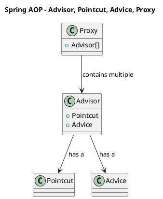
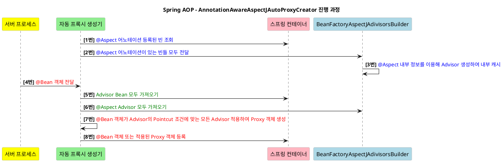

---
aliases:
  - Proxy
  - Dynamic Proxy
  - CGLIB
  - 프록시
  - Interface Proxy
  - Class Proxy
  - ProxyFactory
  - BeanPostProcessor
tags:
  - Java
  - Spring
특징:
---
# Proxy
Proxy(대리인)

초기화 지연, 접근 제어, 로깅, 캐싱 등, 기존 대상 원본 객체를 수정 없이 추가 동작 기능들을 가미하고 싶을 때 사용하는 코드 패턴

**`RealSubject`는 자신의 기능에만 집중을 하고** 그 이외 **부가 기능을 제공하거나 접근을 제어하는 역할을 `Proxy` 객체에게 위임**
이로 인해 `SOLID`원칙 중 `OCP`와 `SRP`를 지향하는 코드로 작성이 가능
![[config/AttachedFile/SRP.png|800]]

Wrapper 기능과 같은게 아닌가 생각 듬 (똑같은 이름으로 기능만 추가하는 방식)
이러니 [[2.Ref(데이터 및 정보 저장)/Spring/공통관심사/AOP|AOP]] 기능을 만들때 사용 될 듯
하지만 단점은 역시 `interface` 가 필요하고 상속 받아 대상을 실행하면서 추가적인 기능을 넣어야하기 때문에 소스가 굉장히 많아지기 때문에 소스가 지저분함
## 주요 기능
- 접근 제어
	- 권한에 따른 접근 차단
	- 캐싱
	- 지연 로딩
- 부가 기능 추가
	- 원래 서버가 제공하는 기능에 더해서 부가 기능을 수행
		- 요청 값이나 응답 값을 중간에 변형
		- 실행 시간을 측정
## 장점
- 기존 객체를 수정하지 않고 일련의 로직을 프록시 패턴을 통해 추가
- 실제 객체를 수행하기 이전에 전처리를 하거나, 기존 객체를 캐싱할 수 있음
## 단점
- 객체 생성시 한단계 거치게 됨으로 빈번한 객체 생성이 필요해서 성능 저하(and 귀찮음)
- 계층이 추가되어 코드의 복잡도 증가 (로직이 너무 난해하고 복잡해짐)
## 예제
Interface Proxy 와 Class Proxy 차이
- 클래스 프록시는 해당 클래스에만 적용 가능 / 인터페이스 프록시는 인터페이스만 같으면 모든 곳에 적용 가능
- 클래스 프록시는 상속을 사용하기 때문에 몇가지 제약 발생
	- 부모 클래스의 생성자를 호출 필요
	- 클래스에 final 키워드가 붙으면 상속 불가
	- 메서드에 final 키워드가 붙으면 [[2.Ref(데이터 및 정보 저장)/개발 이론/오버라이딩 (overriding)|오버라이딩 (overriding)]] 불가
- 인터페이스 프록시는 캐스팅 단점
### Interface Proxy

![[config/AttachedFile/proxy-sample.png]]

```java title:"Proxy 사용하여 A 로직 시간 측정"
interface AInterface {
    String call();
}

class AImpl implements AInterface {
    @Override
    public String call() {
        System.out.println("A 호출");
        return "a";
    }
}

class AProxy implements AInterface {
    AInterface subject;

    AProxy(AInterface subject) {
        this.subject = subject;
    }

    @Override
    public String call() {
        System.out.println("TimeProxy 실행");
        long startTime = System.nanoTime();

        String result = subject.call();

        long endTime = System.nanoTime();
        long resultTime = endTime - startTime;
        System.out.println("TimeProxy 종료 resultTime = " + resultTime);

        return result;
    }
}
```

```java title:"Proxy 사용하여 B 로직 시간 측정"
interface BInterface {
    String call();
}

class BImpl implements BInterface {
    @Override
    public String call() {
        System.out.println("B 호출");
        return "b";
    }
}

class BProxy implements BInterface {
    BInterface subject;

    BProxy(BInterface subject) {
        this.subject = subject;
    }

    @Override
    public String call() {
        System.out.println("TimeProxy 실행");
        long startTime = System.nanoTime();

        String result = subject.call();

        long endTime = System.nanoTime();
        long resultTime = endTime - startTime;
        System.out.println("TimeProxy 종료 resultTime = " + resultTime);

        return result;
    }
}
```

```java title:"똑같은 로직인데 그냥 같은 인터페이스 썻어도 되지 않나 싶지만 어쨋든 불필요한 소스가 낭비된다는걸 보여주는거니까"
public class Client {
    public static void main(String[] args) {
        AInterface proxyA = new AProxy(new AImpl());
        proxyA.call();

        BInterface proxyB = new BProxy(new BImpl());
        proxyB.call();
    }
}
```

해당 예제에서 알 수 있듯이 Proxy 클래스를 만드느라 불필요한 소스가 굉장히 많이 낭비되고 소스 읽기도 힘듬

### Class Proxy
```java title:"인터페이스를 사용하지 않은 프록시"
@Slf4j  
public class ConcreteLogic {  // target Logic
  public String operation() {  
    log.info("ConcreteLogic.operation()");  
    return "ConcreteLogic Data";  
  }  
}

@Slf4j  
public class TimeProxy extends ConcreteLogic {  // Proxy
  private ConcreteLogic concreteLogic;  
  
  public TimeProxy(ConcreteLogic concreteLogic) {  
    this.concreteLogic = concreteLogic;  
  }  
  
  @Override  
  public String operation() {  
    log.info("TimeProxy.operation()");  
    long start = System.currentTimeMillis();  
    String result = concreteLogic.operation();  
    long end = System.currentTimeMillis();  
    log.info("Time: " + (end - start));  
    return result;  
  }  
}

public class ConcreteClient {  
  private final ConcreteLogic concreteLogic;  
  
  public ConcreteClient(ConcreteLogic concreteLogic) {  
    this.concreteLogic = concreteLogic;  
  }  
  
  public void execute() {  
    concreteLogic.operation();  
  }
}

@Test  
void addProxy() {  //실행
  ConcreteLogic concreteLogic = new ConcreteLogic();  
  TimeProxy timeProxy = new TimeProxy(concreteLogic);  
  ConcreteClient concreteClient = new ConcreteClient(timeProxy);  
  concreteClient.execute();  
}
```


# Dynamic Proxy
Proxy 의 단점을 보안하기 위해 컴파일 시점이 아닌 런타임 시점에 프록시를 만들어주는 방식을 동적 프록시 라고 함
java 에서 제공하는 [[2.Ref(데이터 및 정보 저장)/Spring/공통관심사/Reflection|Reflection]] 기능을 사용

```java
public class Proxy implements java.io.Serializable {
@CallerSensitive  
public static Object newProxyInstance(ClassLoader loader,  // 클래스 로더
                                      Class<?>[] interfaces, // 타겟의 인터페이스
                                      InvocationHandler h) {...} // 타깃의 정보가 포함된 Handler
}
```

- `ClassLoader loader`
	- 프록시 클래스를 만들 클래스 로더(Class Loader)
	- Proxy 객체가 구현할 Interface에 Class Loader 를 얻어오는 것이 일반적
- `Class<?>[] interfaces`
	- 프록시 클래스가 구현하고자 하는 인터페이스 목록(배열)
	- 메서드를 통해 생성 될 Proxy 객체가 구현할 Interface를 정의
- `InvocationHandler h`
	- 프록시의 메서드(invoke)가 호출되었을때 실행되는 핸들러 메서드

`invoke()` 메서드는 동적 프록시의 메서드가 호출되었을때, 이를 낚아채어 대신 실행되는 메서드
메서드 [[2.Ref(데이터 및 정보 저장)/개발 이론/Parameter|파라메터]] 를 통해 어떤 메서드가 실행되었는지 메서드 정보와 메서드에 전달된 인자까지 알 수 있음
```java
public interface InvocationHandler {
    public Object invoke(Object proxy, Method method, Object[] args)
        throws Throwable;
}
```
- `Object proxy` : 프록시 객체
- `Method method` : 호출한 메서드 정보
- `Object[] args` : 메서드에 전달된 매개변수 (배열)

## 단점
- 타입을 무조건 `interface` 로 넣어줘야함
	- 해당 방법을 해결하기 위해 CGLIB 를 이용해서 바이트코드를 조작해서 동적 프록시 기술을 응용하는 라이브러리로 해결할 수 있음
	- 스프링에서는 인터페이스가 있을 경우 JDK Dynamic Proxy 를 사용하며 클래스의 경우 [[#CGLIB 라이브러리]]를 사용
## 예제
![[config/AttachedFile/dynamic-proxy.png]]

```java
import java.lang.reflect.InvocationHandler;
import java.lang.reflect.Method;
import java.lang.reflect.Proxy;

// InvocationHandler 프록시 메서드 핸들러를 클래스 필드 변수를 이용해야 하기 때문에 재정의 함
class MyProxyHandler implements InvocationHandler {
    private final Object target;

    MyProxyHandler(Object target) {
        this.target = target;
    }

    @Override
    public Object invoke(Object proxy, Method method, Object[] args) throws Throwable {
        System.out.println("TimeProxy 실행");
        long startTime = System.nanoTime();

        Object result = method.invoke(target, args); // 파라미터로 전달받은 메서드를 invoke로 실행

        long endTime = System.nanoTime();
        long resultTime = endTime - startTime;
        System.out.println("TimeProxy 종료 resultTime = " + resultTime);

        return result;
    }
}
```

```java
public class Client {
    public static void main(String[] args) {
    
        AInterface proxyA = (AInterface) Proxy.newProxyInstance(
                AInterface.class.getClassLoader(),
                new Class[]{AInterface.class},
                new MyProxyHandler(new AImpl())
        );
        proxyA.call();

        BInterface proxyB = (BInterface) Proxy.newProxyInstance(
                BInterface.class.getClassLoader(),
                new Class[]{BInterface.class},
                new MyProxyHandler(new BImpl())
        );
        proxyB.call();
    }
}
```

### 메서드 필터링 예제
```java
interface AInterface {
    String call();
    void print();
    void run();
}

class AImpl implements AInterface {
    @Override
    public String call() {
        System.out.println("A 호출");
        return "a";
    }

    @Override
    public void print() {
        System.out.println("A print @@@@@@@");
    }

    @Override
    public void run() {
        System.out.println("A Running !!!!!!!!!");
    }
}


public class Client {
    public static void main(String[] arguments) {

        AInterface proxyA = (AInterface) Proxy.newProxyInstance(
                AInterface.class.getClassLoader(),
                new Class[]{AInterface.class},
                (proxy, method, args) -> {
                    Object target = new AImpl();

                    // 실행한 메서드가 call 일 경우 로깅 기능을 가미하여 리턴
                    if(method.getName().equals("call")) {
                        System.out.println("TimeProxy 실행");
                        long startTime = System.nanoTime();

                        Object result = method.invoke(target, args); // 파라미터로 전달받은 메서드를 invoke로 실행

                        long endTime = System.nanoTime();
                        long resultTime = endTime - startTime;
                        System.out.println("TimeProxy 종료 resultTime = " + resultTime);

                        return result;
                    }

                    // 만일 메서드가 run이나 print 일경우 로깅 기능을 가미하지않고 그냥 그대로 원본 대상 객체의 메서드를 실행하고 리턴하도록 지정
                    return method.invoke(target, args);
                }
        );

        proxyA.call();
        proxyA.print();
        proxyA.run();
    }
}
```
> 람다 방식으로 작성
# CGLIB 라이브러리
[[#Dynamic Proxy]]의 단점을 해결할 수 있는 라이브러리 
`JDK`의 `Dynamic Proxy` 와는 다르게 인터페이스가 아닌 클래스를 대상으로 `ByteCode`를 조작해 프록시 생성할 수 있는 라이브러리
오히려 `Dynamic Proxy` 비해서 성능이 좋으며 그 효과로 인해 스프링 프레임워크에 기본으로 내장

스프링 프로젝트가 아닌 일반 자바 프로젝트의 경우 외부 라이브러리 다운 & 적용이 필요
[CGLIB 다운로드](https://github.com/cglib/cglib/releases/tag/RELEASE_3_3_0) 다른 버전은 알아서 찾아

```java
import net.sf.cglib.proxy.*; // cglib 임포트 (다운 받아서 사용할때)
import org.springframework.cglib.proxy.*;  // cglib 임포트 (Spring 내부에서 사용할 때)
```
> import 위치
```java
public Object intercept(
	Object o,                    // CGLIB가 적용된 객체
	Method method,               // 호출된 메서드
	Object[] args,               // 메서드를 호출하면서 전달된 인수
	MethodProxy methodProxy      // 메서드 호출에 사용
) throws Throwable {}
```
## 단점
- 기본적으로 **클래스 상속(extends)를 통해 프록시 구현**이 되기 때문에 타겟 클래스가 상속이 불가능할때는 당연히 프록시 등록이 불가능
- 메서드에 final 키워드가 붙게 되면 해당 메서드를 오버라이딩하여 사용 할 수 없기 때문에 결과적으로 프록시 메서드 로직이 동작하지 않음
- 통합적으로 상속에 있어서 제한이 있는 대상은 사용이 불가능
## 사용이 불가능한 상황
- 추상 클래스(abstract class)
- 클래스의 생성자를 private 하여 생성자를 제한할 경우
- 기본 생성자가 없는 경우 사용 불가
- 생성자 2번 호출 문제
	- 실제 target 객체를 생성할 때
	- 프록시 객체를 생성할 때 부모 클래스의 생성자 호출
- `final` 키워드 사용하는 클래스 또는 메서드 사용 불가

`final` 은 에러는 안뜨는데 아무런 에러 없이 `Proxy` 동작하지 않음
추상클래스(`abstract class`)와 생성자를 `private` 경우 컴파일 단계에서 에러가 뜸

## Spring 의 대응한 해결 방법
- Spring 4.0 이상부터 CGLIB 기본 생상자가 필수인 문제를 해결
	- `objenesis`라는 라이브러리를 이용해서 기본 생성자 없이 객체 생성 가능하도록 추가
	  해당 라이브러리는 생성자 호출 없이 객체를 생성할 수 있게 해줌
- 생성자 2번 호출 문제
	- `objenesis` 사용으로 생성자 호출 없이 객체 생성으로 생성자 1번만 호출
- Spring boot 2.0 이상부터 CGLIB 기본 사용
`{properties icon title:"강제로 CGLIB 사용하도록 선택하는 방법(이미 default 값)"}spring.aop.proxy-target-class=true

## 예제
```java title:"모두 풀어서 쓰는 방법 (추천x)"
import org.springframework.cglib.proxy.*;  
import java.lang.reflect.Method;
// 프록시 핸들러
class MyProxyInterceptor implements MethodInterceptor {

    private final Object target;

    MyProxyInterceptor(Object target) {
        this.target = target;
    }

    @Override
    public Object intercept(
            Object o,
            Method method,
            Object[] args,
            MethodProxy methodProxy
    ) throws Throwable {

        System.out.println("TimeProxy 실행");
        long startTime = System.nanoTime();

        //Object result = method.invoke(target, args); // 파라미터로 전달받은 메서드를 invoke로 실행
        Object result = methodProxy.invoke(target, args); // MethodProxy 사용하는 것이 속도적으로 조금 더 빠르다함

        long endTime = System.nanoTime();
        long resultTime = endTime - startTime;
        System.out.println("TimeProxy 종료 resultTime = " + resultTime);

        return result;
    }
}

// 프록시를 적용할 대상 타켓
class Subject {
    public void call() {
        System.out.println("서비스 호출");
    }
}

public class Client {
    public static void main(String[] arguments) {

        // 1. 프록시 등록 (CGLIB는 Enhancer를 사용해서 프록시를 등록한다)
        Enhancer enhancer = new Enhancer();
        enhancer.setSuperclass(Subject.class); // CGLIB는 구체 클래스를 상속 받아서 프록시를 생성하기 때문에 상혹할 구체 클래스를 지정
        enhancer.setCallback(new MyProxyInterceptor(new Subject())); // 프록시 핸들러 할당

        // 2. 프록시 생성
        Subject proxy = (Subject) enhancer.create(); // setSuperclass() 에서 지정한 클래스를 상속 받아서 프록시가 만들어진다.

        // 3. 프록시 호출
        proxy.call();
    }
}
```

```java title:"간략하게 람다 방식을 사용하는 방법"
public class Client {
    public static void main(String[] arguments) {
        
        Subject proxy = (Subject) Enhancer.create(Subject.class, (MethodInterceptor) (o, method, args, methodProxy) -> {
            Subject target = new Subject();
            System.out.println("TimeProxy 실행");
            long startTime = System.nanoTime();
            // Object result = method.invoke(target, args); // 파라미터로 전달받은 메서드를 invoke로 실행
            Object result = methodProxy.invoke(target, args); // MethodProxy 사용하는 것이 속도적으로 조금 더 빠르다함
            long endTime = System.nanoTime();
            long resultTime = endTime - startTime;
            System.out.println("TimeProxy 종료 resultTime = " + resultTime);
            return result;
        });
        
        proxy.call();
    }
}
```
> 람다 방식으로 소스 작성

# ProxyFactory
Spring 지원하는 프록시 방법
[[#Dynamic Proxy]]와 [[#CGLIB 라이브러리]] 방법을 둘 다 상황에 따라 지원해주는 `ProxyFactory` 방법
[[#Dynamic Proxy]] 에서 사용하는 `InvocationHandler` 클래스와 [[#CGLIB 라이브러리]] 에서 사용하는 `MethodInterceptor` 둘 다 지원하기 위한 `Advice`를 제공

![[config/AttachedFile/Pasted image 20240613112440.png|400]]![[config/AttachedFile/Pasted image 20240613112527.png|500]]
생성은 `ProxyFactory` 로직 처리는 `Advice` 특정 조건이 맞을때만 돌아가게 하는 기능은 `pointcut` 개념을 지원
`ProxyFactory` 로 생성한 프록시의 경우 [[2.Ref(데이터 및 정보 저장)/Spring/공통관심사/AopUtils|AopUtils]] 사용 가능

```java title:"CGLIB 동일한 클래스 이름이기에 패키지 주의"
package org.aopalliance.intercept;
@FunctionalInterface  
public interface MethodInterceptor extends Interceptor {  
  @Nullable  
  Object invoke(@Nonnull MethodInvocation invocation) throws Throwable;  
}
```
- `MethodInvocation invocation` 다음 메서드를 호출하는 방법, 현재 프록시 객체 인스턴스, `args` 정보를 포함 (기존의 파라메터로 제공되는 부분들을 모두 안으로 들임)
## 단점
- 너무 많은 설정
- 컴포넌트 스캔
## 예제
```java title:"Advice 예제" hl:6
@Slf4j
public class TimeAdvice implements MethodInterceptor {
  @Override
  public Object invoke(MethodInvocation invocation) throws Throwable {
    long start = System.currentTimeMillis();
    Object result = invocation.proceed();
    long end = System.currentTimeMillis();
    log.info("소요 시간: {}", end - start);
    return result;
  }
}
```

```java title:"lambda 사용하지 않은 것과 사용하여 만든 것"
public interface AInterface {  
  public String call();  
}

public class AImpl implements AInterface {  
  @Override  
  public String call() {  
    return "AImpl.call()";  
  }  
}

@Test  
@DisplayName("인터페이스가 없으면 CGLIB를 사용")
void testObj() {  
  AInterface a = new AImpl();  
  ProxyFactory proxyFactory = new ProxyFactory(a);  
  proxyFactory.addAdvice(new TimeAdvice());  
  AInterface proxy = (AInterface) proxyFactory.getProxy();  
  proxy.call();  
}

// MethodInterceptor 직접 정의하지 않은 방법
@Test  
@DisplayName("lambda로 구현한 MethodInterceptor를 사용")  
void testObj2() {  
  AInterface a = new AImpl();  
  ProxyFactory proxyFactory = new ProxyFactory(a);  
  proxyFactory.addAdvice((MethodInterceptor) invocation -> {  
    log.info("before");  
    Object result = invocation.proceed();  
    log.info("after");  
    return result;  
  });  
  AInterface proxy = (AInterface) proxyFactory.getProxy();  
  proxy.call();  
}
```

```java title:"무조건 CGLIB 사용하는 방법"
@Test  
@DisplayName("ProxyTargetClass를 true로 설정하면 CGLIB를 사용")  
void proxyFactory2() {  
  AImpl a = new AImpl();  
  ProxyFactory proxyFactory = new ProxyFactory(a);  
  proxyFactory.setProxyTargetClass(true);  
  proxyFactory.addAdvice(new TimeAdvice());  
  AImpl proxy = (AImpl) proxyFactory.getProxy();  
  
  log.info("proxy: {}", proxy.getClass());  
  log.info("proxy super: {}", proxy.getClass().getSuperclass());  
  proxy.save();  
  
  Assertions.assertTrue(AopUtils.isCglibProxy(proxy));  
}
```

## `Proxy = (Advisor = Pointcut + Advice)[]`
- 포인트컷(`pointcut`) : 어디에 부가 기능을 적용할지, 어디에 부가 기능을 적용하지 않을지 판단하는 필터링 로직(주로 클래스와 메서드 이름으로 필터링)
	- 프록시 적용 대상 여부를 체크해서 꼭 필요한 곳에만 프록시 적용([[#BeanPostProcessor(빈 후처리기)]] 자동 생성)
	- 프록시의 어떤 메서드가 호출 되었을 때 어드바이스를 적용할지 판단
- 어드바이스(`Advice`) : 프록시가 호출하는 부가 기능(프록시 로직)
- 어드바이저(`Advisor`) : 하나의 포인트컷과 하나의 어드바이스를 가지고 있는 것



```java title:"pointcut"
package org.springframework.aop;  
  
public interface Pointcut {  
  Pointcut TRUE = TruePointcut.INSTANCE;  
  
  ClassFilter getClassFilter();  
  
  MethodMatcher getMethodMatcher();  
}
```

```java title:"MethodMatcher"
public interface MethodMatcher {  
  MethodMatcher TRUE = TrueMethodMatcher.INSTANCE;  
  
  boolean matches(Method method, Class<?> targetClass);  
  // isRuntime true 일 경우 아래 함수가 호출, false 일 경우 위에 함수가 호출 (args 때문에 성능 이슈로 나눔)
  boolean isRuntime();  
  
  boolean matches(Method method, Class<?> targetClass, Object... args);  
}
```


 > [!hint] `advisor` 는 하나의 `Proxy`에  여러개를 등록 가능
```java title:"여러 advisor 등록하는 방법"
@Slf4j  
public class MultiAdvisorTest {  
  @Slf4j  
  static class Advice1 implements MethodInterceptor {  
    @Override  
    public Object invoke(MethodInvocation invocation) throws Throwable {  
      log.info("Advice1.invoke() Start");  
      Object result = invocation.proceed();  
      log.info("Advice1.invoke() End");  
      return result;  
    }  
  }  
  
  @Slf4j  
  static class Advice2 implements MethodInterceptor {  
    @Override  
    public Object invoke(MethodInvocation invocation) throws Throwable {  
      log.info("Advice2.invoke() Start");  
      Object result = invocation.proceed();  
      log.info("Advice2.invoke() End");  
      return result;  
    }  
  }  
  
  @Test  
  @DisplayName("여러 Advisor 사용")  
  void multiAdvisor() {  
    AInterface a = new AImpl();  
    ProxyFactory proxyFactory = new ProxyFactory(a);  
    DefaultPointcutAdvisor advisor1 = new DefaultPointcutAdvisor(Pointcut.TRUE, new Advice1());  
    DefaultPointcutAdvisor advisor2 = new DefaultPointcutAdvisor(Pointcut.TRUE, new Advice2());  
    proxyFactory.addAdvisor(advisor1);  
    proxyFactory.addAdvisor(advisor2);  
    AInterface proxy = (AInterface) proxyFactory.getProxy();  
    proxy.call();  
  }  
}
```
결과는 넣은 순서대로 표기
```log title:"여러 어드바이저 등록 시 실행되는 순서는 넣은 순서대로"
10:03:56.378 [Test worker] INFO hello.proxy.advisor.MultiAdvisorTest$Advice1 - Advice1.invoke() Start
10:03:56.379 [Test worker] INFO hello.proxy.advisor.MultiAdvisorTest$Advice2 - Advice2.invoke() Start
10:03:56.379 [Test worker] INFO hello.proxy.common.testobj.AImpl - AImpl.call()
10:03:56.380 [Test worker] INFO hello.proxy.advisor.MultiAdvisorTest$Advice2 - Advice2.invoke() End
10:03:56.380 [Test worker] INFO hello.proxy.advisor.MultiAdvisorTest$Advice1 - Advice1.invoke() End
```

### 직접 만들어서 써보는 pointcut
```java title:"직접 만들어보는 pointcut"
public interface AInterface {  
  public String call();  
  public String func();  
}

@Slf4j  
public class AImpl implements AInterface {  
  @Override  
  public String call() {  
    log.info("AImpl.call()");  
    return "AImpl.call()";  
  }  
  
  @Override  
  public String func() {  
    log.info("AImpl.func()");  
    return "AImpl.func()";  
  }  
}

class MyMethodMatcher implements MethodMatcher {  
  @Override  
  public boolean matches(Method method, Class<?> targetClass) {  
    boolean result = method.getName().equals("call");  
    log.info("MethodMatcher.matches() method: {} targetClass: {} result: {}", method.getName(), targetClass, result);  
    return result;  
  }  
  
  @Override  
  public boolean isRuntime() {  
    return false;  
  }  
  
  @Override  
  public boolean matches(Method method, Class<?> targetClass, Object[] args) {  
    return false;  
  }  
}  
class MyPointcut implements Pointcut {  
  @Override  
  public ClassFilter getClassFilter() {  
    return ClassFilter.TRUE;  
  }  
  
  @Override  
  public MethodMatcher getMethodMatcher() {  
    return new MyMethodMatcher();  
  }  
}  
  
@Test  
@DisplayName("직접 만든 Pointcut을 사용")  
void advisorTest2() {  
  AInterface a = new AImpl();  
  ProxyFactory proxyFactory = new ProxyFactory(a);  
  DefaultPointcutAdvisor advisor = new DefaultPointcutAdvisor(new MyPointcut(), new TimeAdvice());  
  proxyFactory.addAdvisor(advisor);  
  AInterface proxy = (AInterface) proxyFactory.getProxy();  
  proxy.call();  
  proxy.func();  
}
```

### Spring 제공하는 pointcut
- `NameMatchMethodPointcut` : 메서드 이름 기반으로 매칭. 내부에서 [[2.Ref(데이터 및 정보 저장)/Spring/공통관심사/PatternMatchUtils|PatternMatchUtils]] 사용
- `JdkRegexpMethodPointcut` : JDK 정규 표현식을 기반으로 포인트컷을 생성
- `TruePointcut` : 항상 동작하는 포인트컷
- `AnnotationMatchingPointcut` : 어노테이션으로 매칭
- `AspectJExpressionPointcut` : aspectJ 표현식으로 매칭 (가장 많이 사용)


```java title:"스프링이 제공하는 pointcut 사용"
@Test  
@DisplayName("스프링이 제공하는 Pointcut을 사용")  
void advisorTest3() {  
  AInterface a = new AImpl();  
  ProxyFactory proxyFactory = new ProxyFactory(a);  
  NameMatchMethodPointcut pointcut = new NameMatchMethodPointcut();  
  pointcut.addMethodName("call");  
  DefaultPointcutAdvisor advisor = new DefaultPointcutAdvisor(pointcut, new TimeAdvice());  
  proxyFactory.addAdvisor(advisor);  
  AInterface proxy = (AInterface) proxyFactory.getProxy();  
  proxy.call();  
  proxy.func();  
}
```

# BeanPostProcessor(빈 후처리기)
후킹같은 기능
빈 등록 전에 먼저 BeanPostProcessor(빈 후처리기) 로 전달되어 변경할 것이 있는지 확인 후 [[IOC 컨테이너]]로 이동
보통 후처리기의 적용 조건은 `pointcut`을 이용해서 적용할지 말지 선택
```java title:"BeanPostProcessor"
public interface BeanPostProcessor {
  @Nullable
  default Object postProcessBeforeInitialization(Object bean, String beanName) throws BeansException {
    return bean;
  }

  @Nullable
  default Object postProcessAfterInitialization(Object bean, String beanName) throws BeansException {
    return bean;
  }
}
```
- `postProcessBeforeInitialization()` : 객체 생성 이후에 [[2.Ref(데이터 및 정보 저장)/Spring/Annotation/@PostConstruct|@PostConstruct]] 같은 초기화가 발생하기 전에 호출되는 포스트 프로세서
- `postProcessAfterInitialization()` : 객체 생성 이후에 [[2.Ref(데이터 및 정보 저장)/Spring/Annotation/@PostConstruct|@PostConstruct]] 같은 초기화 발생한 다음에 호출되는 포스트 프로세서

```java title:"특정 packageName 이 포함된 Bean 들만 Proxy 설정"
@Slf4j
public class PackageLogTracePostProcessor implements BeanPostProcessor {
  // 특정 패키지 하위의 빈들만 적용
  private final String basePackage;
  private final Advisor advisor;

  public PackageLogTracePostProcessor(String basePackage, Advisor advisor) {
    this.basePackage = basePackage;
    this.advisor = advisor;
  }

  @Override
  public Object postProcessAfterInitialization(Object bean, String beanName) throws BeansException {
    log.info("PackageLogTracePostProcessor.postProcessAfterInitialization() Start");
    log.info("bean: {} / beanName: {}", bean.getClass(), beanName);

    // 프록시 대상여부 체크
    String packageName = bean.getClass().getPackageName();

    if (!packageName.startsWith(basePackage)) {
      return bean;
    }
    
    // 프록시 생성
    ProxyFactory proxyFactory = new ProxyFactory(bean);
    proxyFactory.addAdvisor(advisor);
    Object proxy = proxyFactory.getProxy();

    log.info("target: {} / proxy: {}", bean.getClass(), proxy.getClass());
    log.info("PackageLogTracePostProcessor.postProcessAfterInitialization() End");
    return proxy;
  }
}
```

# 스프링이 제공하는 빈 후처리기
==여기서부터는 사실 [[2.Ref(데이터 및 정보 저장)/Spring/공통관심사/AOP|AOP]]  아니냐?==

`{gradle title:"필수 필요" icon}implementation 'org.springframework.boot:spring-boot-starter-aop'`
스프링 부트가 없던 시절에는 `@EnableAspectJAutoProxy` 를 직접 사용해야 적용이 되었는데 이제는 스프링 부트가 알아서 사용
해당 설정을 하는 경우 `AutoProxyCreator` 이라는 자동 프록시 생성기를 등록
`AnnotationAwareAspectJAutoProxyCreator` 라는 빈 후처리기가 스프링 빈에 자동 등록

`AnnotationAwareAspectJAutoProxyCreator` : 스프링 빈으로 등록된 `Advisor`들을 자동으로 찾아서 프록시가 필요한 곳에 자동으로 프록시를 적용


과정
스프링이 @Bean -> 자동 프록시 생성기
자동 프록시 생성기 -> 스프링 컨테이너에 Advisor 모두 조회
Advisor 들을 등록하려는 @Bean 에 적용 가능한지 포인트컷 확인


- `BeanFactoryAspectJAdivisorsBuilder` : `@Aspect` 정보를 기반으로 `pointcut`, `Advice`, `Advisor` 생성하고 보관
  `@Aspect` 정보를 기반으로 어드바이저를 만들고 Aspect 빌더 내부 저장소에 캐시
  캐시에 어드바이저가 만들어져 있는 경우 저장된 어드바이저 반환

## AOP 에서 거진 이것만 쓰는 pointcut `AspectJExpressionPointcut`
```java title:"AspectJExpressionPointcut 사용 예시"
@Bean  
public Advisor advisor2(LogTrace logTrace) {  
  AspectJExpressionPointcut pointcut = new AspectJExpressionPointcut();  
  pointcut.setExpression("execution(* hello.proxy.app..*(..))");  
  return new DefaultPointcutAdvisor(pointcut, new LogTraceAdvice(logTrace));  
}
```

- `*` : 모든 반환 타입
- `hello.proxy.app..` : 해당 패키지와 그 하위 패키지
- `*(..)` : `*` 모든 메서드 이름, `(..)` 파라메터 상관 없음

```java title:"noLog 라는 함수만 적용 안하는 방법"
@Bean  
public Advisor advisor3(LogTrace logTrace) {  
  AspectJExpressionPointcut pointcut = new AspectJExpressionPointcut();  
  pointcut.setExpression("execution(* hello.proxy.app..*(..)) && !exclude(* hello.proxy.app..noLog*(..))");  
  return new DefaultPointcutAdvisor(pointcut, new LogTraceAdvice(logTrace));  
}
```


# AOP
[[2.Ref(데이터 및 정보 저장)/Spring/공통관심사/AOP|AOP]]
[[2.Ref(데이터 및 정보 저장)/Spring/공통관심사/AspectJ|AspectJ]] 
[[2.Ref(데이터 및 정보 저장)/Spring/Annotation/@Aspect|@Aspect]]
AOP 내용은 너무 많아서 분할
애초에 자주 사용되는 내용은 AOP

[[2.Ref(데이터 및 정보 저장)/Spring/공통관심사/AOP|AOP]]


