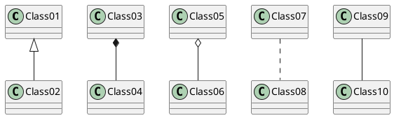
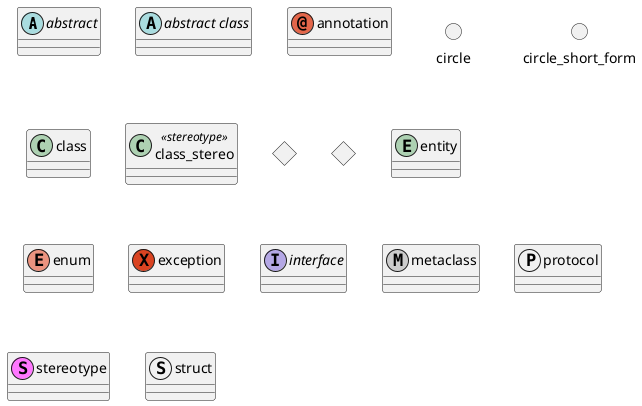
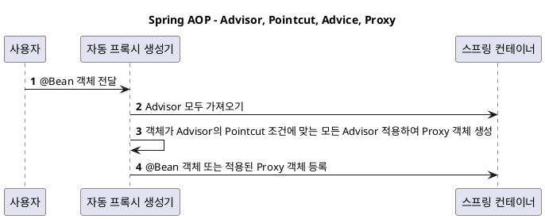

---
aliases:
  - plantuml
tags:
  - Obsidian
  - Obsidian/plugin
특징:
isPublic: true
---
# plantuml
uml 적는 플러그인
[설명서](https://pdf.plantuml.net/PlantUML_Language_Reference_Guide_ko.pdf)

각종 필터 동작



```
@startuml
abstract        abstract
abstract class  "abstract class"
annotation      annotation
circle          circle
()              circle_short_form
class           class
class           class_stereo  <<stereotype>>
diamond         diamond
<>              diamond_short_form
entity          entity
enum            enum
exception       exception
interface       interface
metaclass       metaclass
protocol        protocol
stereotype      stereotype
struct          struct
@enduml
```


